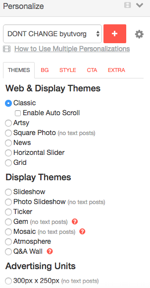
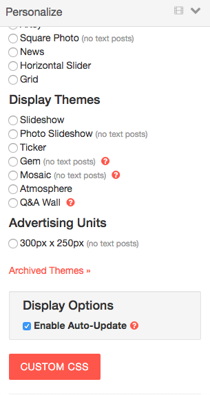
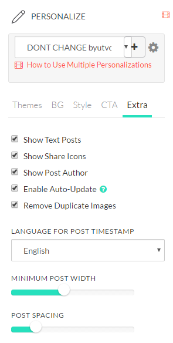

### This document exaplains the online configuration for our tint lists.

# Classic

### Themes


<br>
Note: `Custom CSS` is set.  These styles are found in `styles/custom-css.less`

Set Custom CSS as follows:

```html
</style>
<style>
    @import url("https://www.byutv.org/styles/widgets/list/tint-theme/custom-css.css");
</style>
```

<br>

### BG
Note: These settings do not matter.

<br>

### Style
Note: These settings do not matter.

<br>

### Extra

<br>
Notes:
- Minimum Post Width: 250
- Post Spacing: 10

<br>